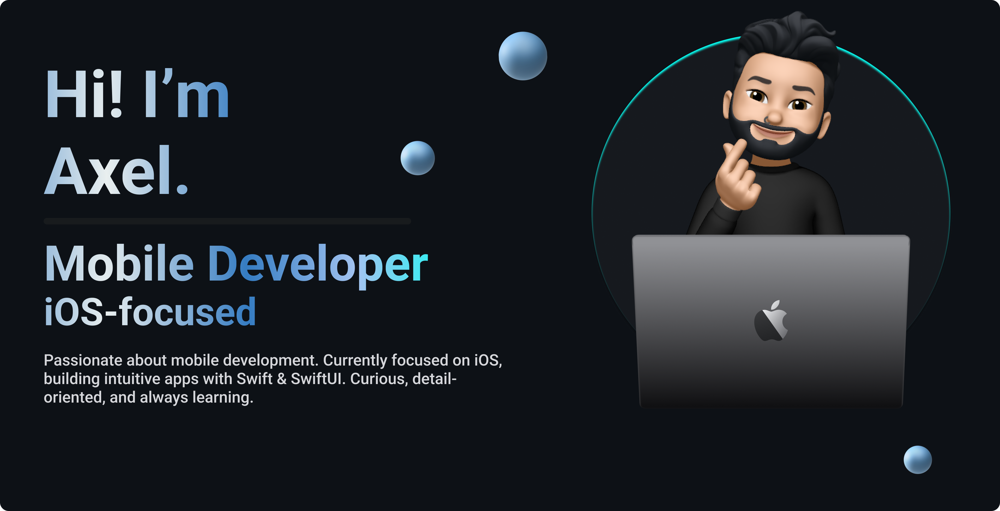

  

## Hi there 👋

I’m Axel, a passionate **mobile developer** in training!

I’m currently studying **Cross-Platform Application Development** at BirtLH in the Basque Country, and in my spare time, I’m diving deep into iOS development with **Swift** and **SwiftUI**. Technology has always been my passion. I worked for over four years at **Apple**, where I helped users solve software issues and learn how to use their devices. That experience sparked my interest in app development, and in 2023 I decided to fully dedicate myself to programming.

I'm especially focused on building simple and clean apps with good UX. I’m eager to keep growing as a developer and contribute to projects that make a difference. 

When I’m not coding, you’ll find me:
- ✈️ Traveling
- 📖 Finishing a book I can’t put down
- 🐱 Taking care of my two little dragons: **Moon** and **Melo**

---

### 📱 My latest app
I just launched **[Tile](https://apple.co/4fIMNHt)** on the App Store! Tile helps you **track subscriptions, organize them by category, and never miss a payment**. 
For more info, visit the [Tile website](https://tileapp.byaxel.dev).

---

### How to reach me

You can find me on [byaxel.dev](https://byaxel.dev)

<!--
**byaxel/byaxel** is a ✨ _special_ ✨ repository because its `README.md` (this file) appears on your GitHub profile.
-->
